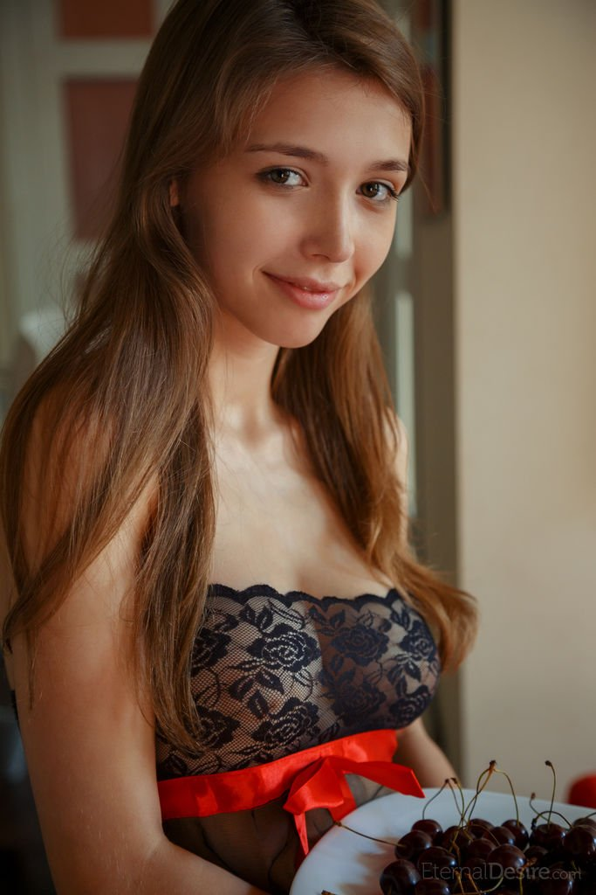
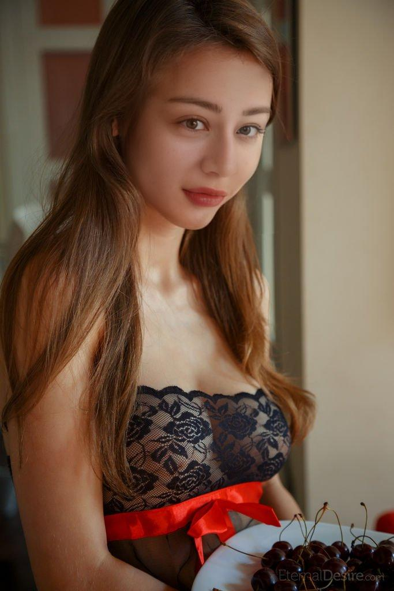

# FaceSwap

AI换脸是几年前比较火的技术，最近对AI感兴趣，且性致来了，就找了几个项目进行了参考学习。

主要基于[Faceswap-Deepfake-Pytorch](https://github.com/Oldpan/Faceswap-Deepfake-Pytorch)这一项目，在其提供的64x64的模型基础上，做出了128x128的模型，虽然最后训练效果一般。

**基本思路：**

1. 人脸提取，使用[facenet-pytorch](https://github.com/timesler/facenet-pytorch)提取人脸
2. 人脸转换，也就是AI换脸的核心部分，用本项目训练好的模型完成这一任务
3. 人脸增强，无论是64x64还是128x128的结果，图片分辨率均过低，需要进行人脸增强。使用[GFPGAN](https://github.com/TencentARC/GFPGAN)进行人脸增强
4. 人脸融合，在人脸转换部分，背景变得模糊，直接拼接效果不好，需要取出人脸的部分再进行拼接。使用[dlib](https://github.com/davisking/dlib)获取人脸关键点，[81点的模型](https://github.com/codeniko/shape_predictor_81_face_landmarks)有时效果更好。融合部分，参考项目找不到了，抱歉。

**效果：**

原图：

换脸后：

差强人意吧